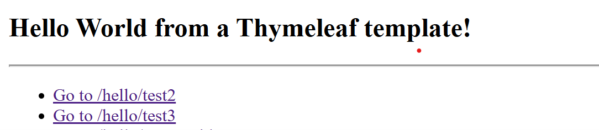
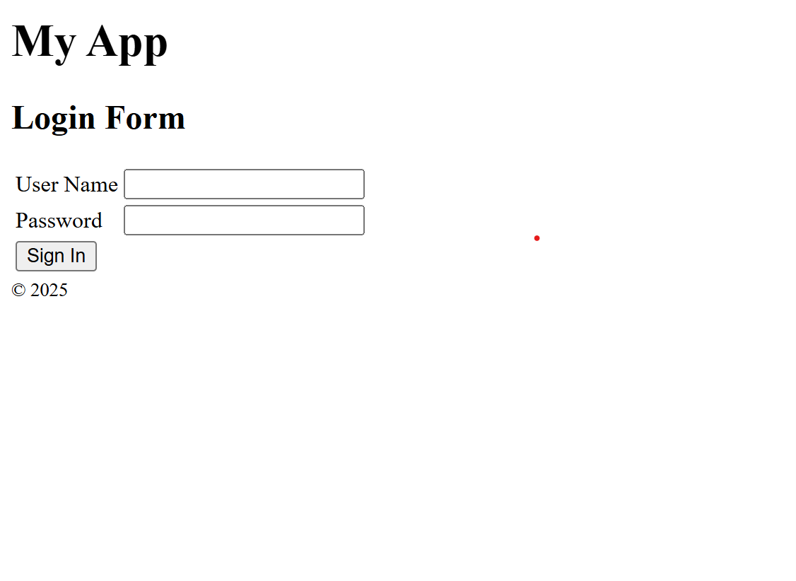
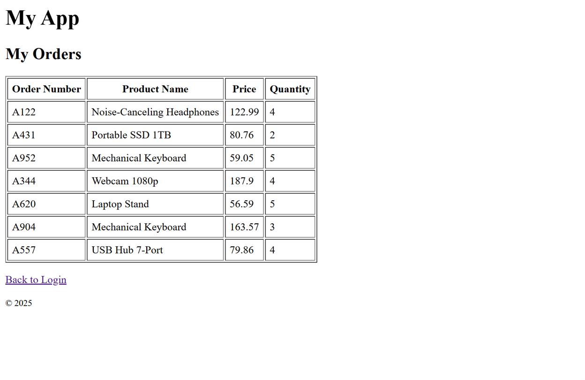
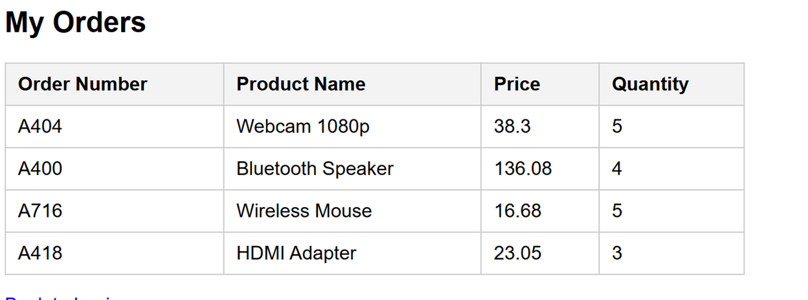
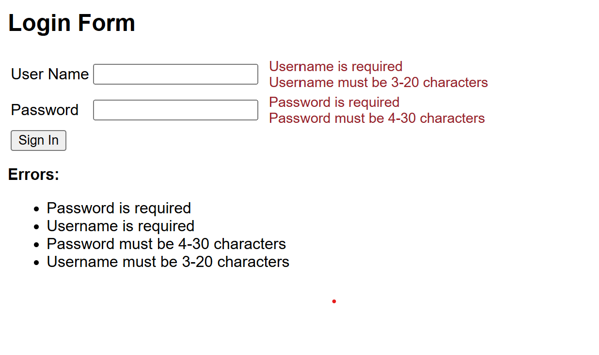

**Name:Devin Puckett**  
**Course:Cst-339**  
**Date:09/02/2025** 
**Professor:Bobby Estey**

---

## 1)  Website active with spring mvc 

Hello page renders the “Hello Spring MVC Framework!”
---

## 2) Website active with ModelandView

ModelAndView page renders successfully, showing the heading “Hello World from ModelAndView!” with a second line “Another Hello World from ModelAndView!” confirming the view and data were returned together.
---

## 3) Website active with Thymeleaf

Thymeleaf template renders successfully, showing the “Hello World from a Thymeleaf template!”
---

## 4) First active login page 

This shows a successful registration redirecting to the Products page, with the navbar updated to show Products and Logout.

---

## 5) Showing output in powershell of password

Console log showing the form submission, with username devinp received and password devin2 captured
---

## 6) First order table

Orders page shows my app title, a table of sample orders with order number, product name, price, and quantity, plus a Back to Login link and a 2025 footer.

---

## 7) My orders 

Orders page displays a table of sample orders with columns for Order Number, Product Name, Price, and Quantity, listing entries like Webcam 1080p, Bluetooth Speaker, Wireless Mouse, and HDMI Adapter.

---

## 8) Login validation  bad credentials show error

Login form displays validation errors after an empty submit, showing both fields are required and listing the username and password length rules.

## - Conclusion
For Activity 2 I built a basic Spring MVC app and got it running. I passed data to the pages with the Model and used Thymeleaf to show it. The login form has basic validation, and after login the user can see the orders page. The screenshots in this file show each step working.
